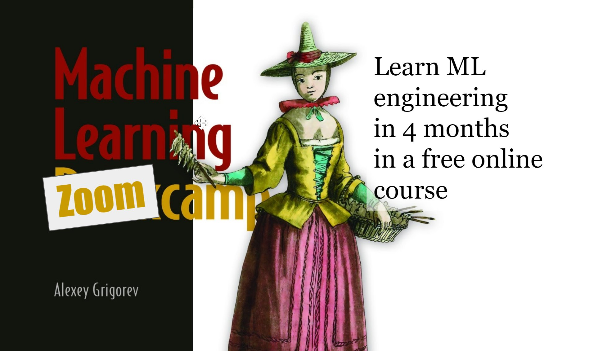

<h2>ML Zoomcamp course</h2>

- In this repo you can check my code of various tasks that I do during 
  ML Zoomcamp course. <a href="https://github.com/alexeygrigorev/mlbookcamp-code.git">Here</a> 
  
- Every folder contains Jupyter notebooks with code and explanation

